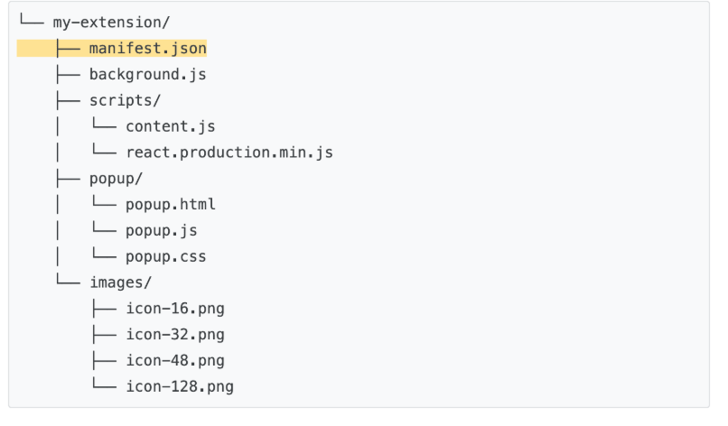

## Hello World Chrome Extension

Basics of Chrome extension development by building my first Hello World extension. 
I will create a "Hello World" example, load the extension locally, locate logs, and explore other recommendations.

### What the extension does:

This extension will display “Hello Extensions” when the user clicks the extension toolbar icon. 

### Structure an extension project

manifest.json : This JSON file describes the extension's capabilities and configuration. For example, most manifest files contain an "action" key which declares the image Chrome should use as the extension's action icon and the HTML page to show in a popup when the extension's action icon is clicked.

There are many ways to structure an extension project; however, the only prerequisite is to place the manifest.json file in the extension's root directory as in following example:

