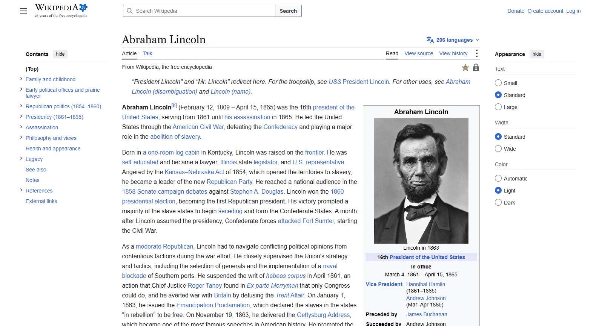
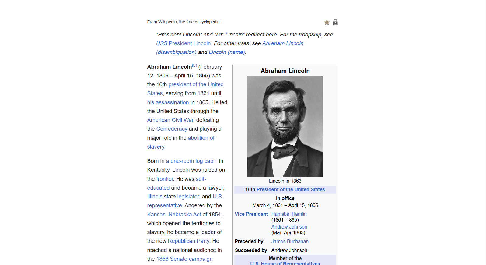

# Focus Mode Browser Extension

A simple Browser Extension built using the Chrome Extensions API (Manifest V3) that helps reduce distractions by hiding common navigation elements and improving the readability of web pages.

## Features

- 🎯 Toggle Focus Mode with a single click
- 📖 Improves readability by centering the main content
- 🚫 Hides common distractions like:
  - Navigation bars
  - Headers
  - Sidebars
  - Footers
- 🔄 Toggle ON/OFF using the extension icon
- ⌨️ Keyboard shortcut support (`Ctrl + B` / `Cmd + B`)

## Preview

**Before:**




**After:**



## Project Structure

```
focus-mode/
│
├── background.js          # Service worker handling extension logic
├── focus-mode.css         # Styles injected into the current webpage
├── manifest.json          # Extension configuration
├── images/
│   ├── icon-16.png
│   ├── icon-32.png
│   ├── icon-48.png
│   └── icon-128.png
└── README.md
```

## Installation

1. Clone this repository.

```bash
git clone https://github.com/your-username/focus-mode-extension.git
```

2. Open Google Chrome.

3. Navigate to:

```
chrome://extensions
```

4. Enable **Developer Mode**.

5. Click **Load unpacked**.

6. Select the project folder.

The extension is now installed.

## Usage

1. Open any webpage.
2. Click the **Focus Mode** extension icon.
3. The extension will:
   - Hide common navigation elements.
   - Center the main content.
   - Improve readability.
4. Click the icon again to disable Focus Mode.

You can also use:

- **Windows/Linux:** `Ctrl + B`
- **macOS:** `⌘ + B`

## Permissions

The extension uses the following permissions:

| Permission | Purpose |
|------------|---------|
| `activeTab` | Access the currently active tab |
| `scripting` | Inject and remove CSS dynamically |

## How It Works

When the extension icon is clicked:

1. The current badge state (`ON` or `OFF`) is checked.
2. The badge is toggled.
3. If the state becomes **ON**, the extension injects `focus-mode.css` into the current page.
4. If the state becomes **OFF**, the injected CSS is removed.

## Acknowledgements

This project is based on Google's **Chrome Extensions "Focus Mode"** tutorial and extends it with several improvements.

Enhancements made in this project include:

- Removed the restriction to Chrome Developer documentation pages, allowing the extension to work on a wider range of websites.
- Redesigned the focus-mode stylesheet to hide common distractions like headers, navigation bars, sidebars, and footers.
- Improved the toggle functionality with dynamic CSS injection/removal and badge state management.


## Limitations

This extension works by hiding common layout elements such as navigation bars and sidebars.

Since every website has a different HTML structure, the appearance may vary across sites. Some pages may require additional CSS rules for the best experience.

## License

This project is licensed under the **MIT License**.